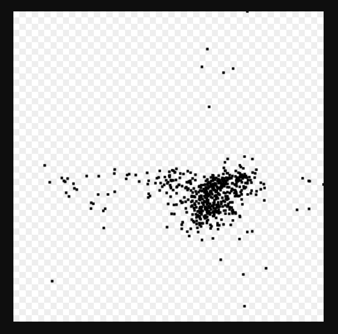

Kamlakant Tripathi, CS 725/825, Fall 2017

# __Clean up country names:__

Country column has various problems in the downloaded data named *universityData*.
I found total 11 categories of mistakes in this data. Firstly, by the - Cluster & Edit column *country* option three different clusters have been merged in one. 
The new cell value is named *United Stated* by replacing the following - 
* US
* USA 
* U.S.
* U.S.A. 
* United States)

For refining the *United States* column more, I used the text facet option to check out the data provided in different name formats of a same country.
By doing so, I found the following details for the different countries - 

1. __United States:__
    - There were 615 count of *United States of America* which I renamed and merged as with *United States*. Now with the addition total United State's count is __46046__.
    - There was one data which was mentioned as *Nassau, Bahamas Fort Myers, FL Jacksonville, FL Miami, FL Miramar, FL Orlando, FL Palm Beach, FL Tampa, FL* and it's state 
      and university clearly shows that it belongs to *United State*. Similarly, one data named *Satellite Locations:* also belongs to United States because I varified the 
      university name which is located inside the United States.
2. __Canada:__
    - Canada had additional information given in country section like telephone number etc. as mentioned below:
      Canada B1P 6L2576, and Canada C1A 4P3 Telephone: 902-566-0439 Fax: 902-566-0795.
3. __Curaçao:__
    - There is one country given as *Cura%C3%A7ao* which has been replace by Curaçao. In my views, this mistake occured due to saving data in different file formats.
4. __United Kingdom:__
    - Replaced the 83 *UK* into United Kingdom.
5. __Netherland:__
    - *the Netherlands* is replaced by Netherland to make it simple.
6. __England, United Kingdom:__
    - countries named as *England, UK* and *England* have been merged with *England, United Kingdom*.
7. __China:__
    - China has been kept as it is but *Republic of China* has been merged with Taiwan because the university data visible 
    in Republic of China is in *Taiwan*. Here is the point where I learned that how to make decision tht where to keep what data.
8. __Scotland, United Kingdom:__
    - Since *Scotland* is a country but a part of United Kingdom but we also have a seperate data for United Kingdom, I renamed and moved all Scotland associated data as *Scotland, United Kingdom*.
9. __Wales, United Kingdom:__
    - Same thing has been done for *Wales* as it is with Scotland.
10. __Russia:__
    - *Russian Faderation* and *Rossija* has been merged into *Russia*
11. __Mexico:__
    - Country name as given “,” sign is replaced by Mexico because the particular university given in our data is located in *Mexico*.

# __Exploring the data with scatter plots__

# __More Data Sets - Is the 27 Club Real?__

__Answer: 24__

To do this task, the very fist step is to downloaded the file *Musicians.xlsx* and created a new project in OpenRefine.

These are the following steps, I followed to refine the data where I found the 24 musicians who are the part of 27 Club.

As indicated in tutorial, first *birthdate* column has been created by *add column based on this column* option using the "birthdate3" column. Now open the numeric 
facet and unchecked all except blank. Since we should remove *blank* because it is unnecessary to keep thes. To remove this, I selected the *all* option then clicked *edit rows* followed by *remove all matching rows*. 
Similarly, same process is done for *deathdate*. Following point number 1 and 2 are commands given in tutorial, have been used for birthdate and deathdate, respectively-
1. **forNonBlank(cells.birthdate1.value, v1, v1, forNonBlank(cells.birthdate2.value, v2, v2, forNonBlank(cells.birthdate3.value, v3, v3, null)))**
2. **forNonBlank(cells.deathdate1.value, v1, v1, forNonBlank(cells.deathdate2.value, v2, v2, forNonBlank(cells.deathdate3.value, v3, v3, null)))**

to clean the data.

After doing this, *year* value for the *birthdate* and *deathdate* columns have been extracted by using the command  **value.match(/.*(\d{4}).*/)[0]** in *edit cells* option. By which
the data is in now **YYYY** format, as we need this only in year format so furthur we can subtract it.
Finally, upto this process, **11751** rows are remains. Moreover, by selecting the option *timeline facet*, two and three weird birthdate and deathdate are visible in dataset which I kept as it is.
Aditionally, our final data structure of birthdate and deathdate is in now YYYY format.
Now, since there is a chance of duplicate data. So I arranged the data to refine it more. I removed the duplicate entries of an individual artist’s data from 11751 rows.
To do this process, First, I used the *sort* option to sort the data then *Blank down* option which is applied on 8400 entries.
Now I applied facet option – *facet by blank* to get false and true choices becuase we need true choices. Here my data has **3290** *false* and **8461** *true* count.
So I removed **8461** true (blank values)from the data. Now the remaining data count is **3290** rows as a refined data.
Moreover, since both data birthdate and deathdate are in string format, I selected *common transform* to numbers option to make it in numeric format. As it is required to be in numeric format for substraction.

For the final step i.e. to find out the musicians who falls under the 27 club category, I created an another column named **deathage**.
To show the approximate age in which musicians died, I used the very last code **cells.deathdate.value - cells.birthdate.value** given in openrefine tutorial.
Finally, to findout the count of 27 club members, I clicked on the deathage column followed by *text facet* and the count is **24** for the musicians who died at the age of 27.

# __CSV File Details:__

In this projct I uploaded final data named **Musicians-xlsx.csv** of CSV format. Aditionally, scatterPlot in png format and two CSV fies of *universityData*.In which one contains 10 
rows only with latitute and logitude named as *universityData-csv_only_with_lat-lon.csv* and another which has 574 rows named *universityData-csv.csv*.

